# Pakistan Tender Intelligence SaaS - Elaboration Diagrams

This file contains implementation-oriented diagrams for the Pakistan Tender Intelligence SaaS. Use these diagrams alongside `CONTEXT.md`, `AGENTS.md`, and `se-principles.md` when building or reviewing the system.

All diagrams use Mermaid syntax.

---

## 1. System Context Diagram

Shows the product boundary, contractor-side actors, tender data sources, and payment/notification dependencies.

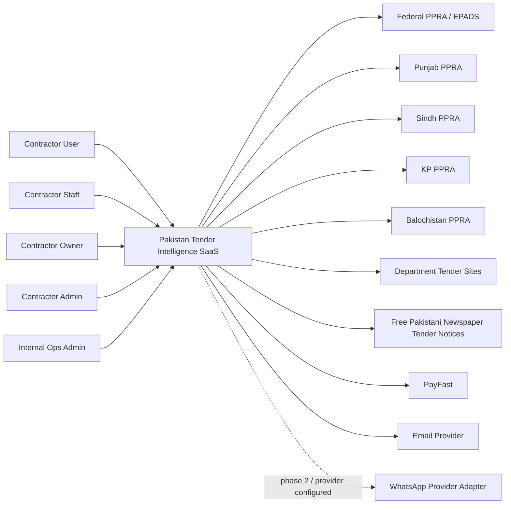

---

## 2. Container Architecture Diagram

Shows the major deployable units and shared infrastructure.

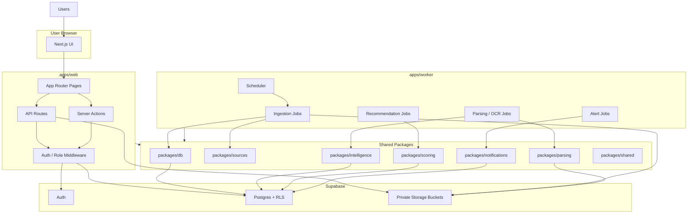

---

## 3. Monorepo Dependency Diagram

Shows intended package dependencies. Keep dependencies pointed inward toward shared contracts, not sideways into unrelated modules.

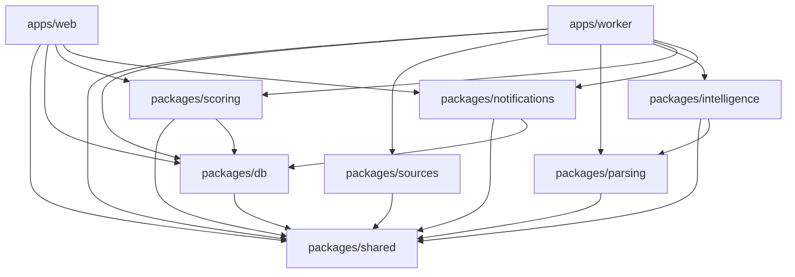

---

## 4. High-Level Data Flow Diagram

Shows how tender data moves from portals, department pages, and newspapers to contractor users.

```mermaid
flowchart LR
    sources["Portals, Departments, Newspapers"]
    fetch["Fetch With Rate Limits"]
    snapshot["Store Raw Snapshot in tender-source-snapshots"]
    parseList["Parse Listing / Detail"]
    docs["Download Documents"]
    parseDocs["Local Parsing / OCR"]
    extract["Rule-Based Field Extraction"]
    classify["Sector Classification"]
    dedupe["Deduplication"]
    qa{"Needs QA?"}
    publish["Publish Tender"]
    score["Rebuild Recommendations"]
    alerts["Send Alerts"]
    users["Users"]

    sources --> fetch
    fetch --> snapshot
    snapshot --> parseList
    parseList --> docs
    docs --> parseDocs
    parseDocs --> extract
    extract --> classify
    classify --> dedupe
    dedupe --> qa
    qa -- "yes" --> qaTasks["Create QA Task"]
    qaTasks --> ops["Ops Review"]
    ops --> publish
    qa -- "no" --> publish
    publish --> score
    score --> alerts
    alerts --> users
```

---

## 5. Tender Ingestion Sequence Diagram

Shows a single source ingestion run from scheduler to database.

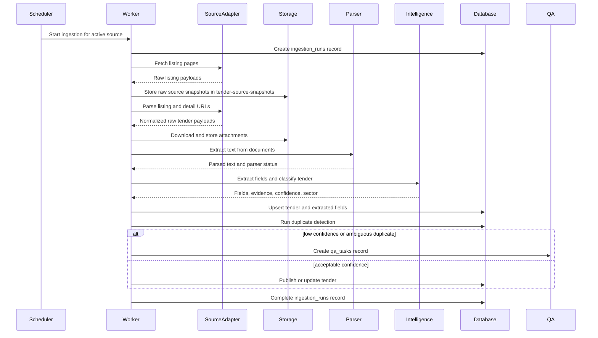

---

## 6. Local Document Parsing Pipeline

Shows deterministic local parsing behavior without hosted document intelligence.

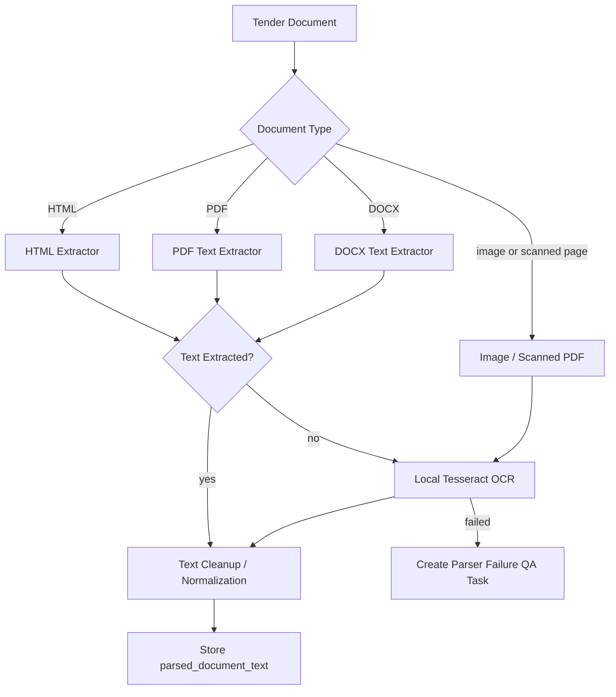

---

## 7. Newspaper Tender Source Pipeline

Shows how free public Pakistani newspaper tender notices are handled as first-class sources.

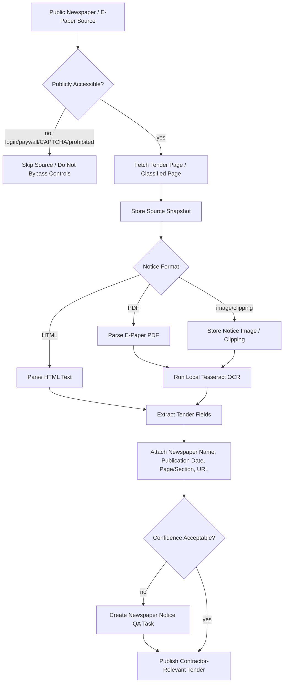

---

## 8. Field Extraction Decision Flow

Shows how a tender fact is extracted, scored, and routed to QA if uncertain.

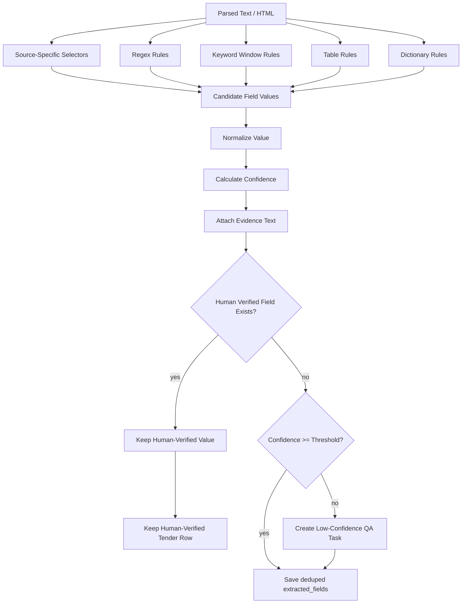

---

## 9. Recommendation and Compliance Flow

Shows how company profile data and tender data produce explainable outputs.

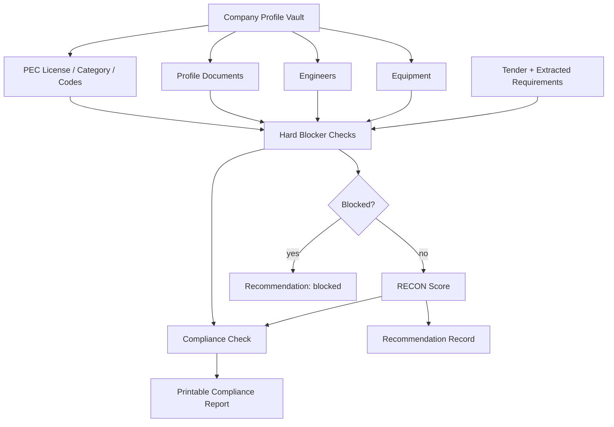

---

## 10. RECON Scoring Breakdown

Shows scoring factors and weights.

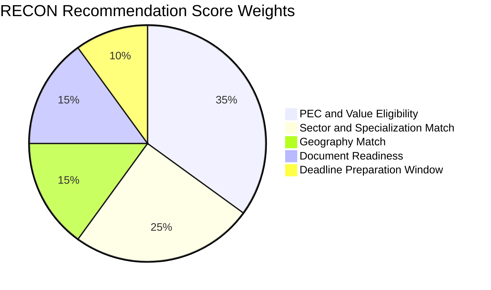

---

## 11. Entity Relationship Diagram

Shows the primary database entities and relationships.

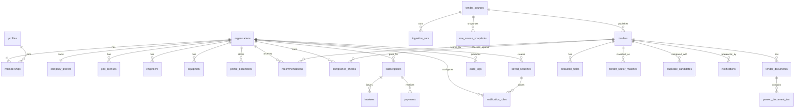

---

## 12. Tenant Isolation and Authorization Flow

Shows the intended security boundary for organization-owned data.

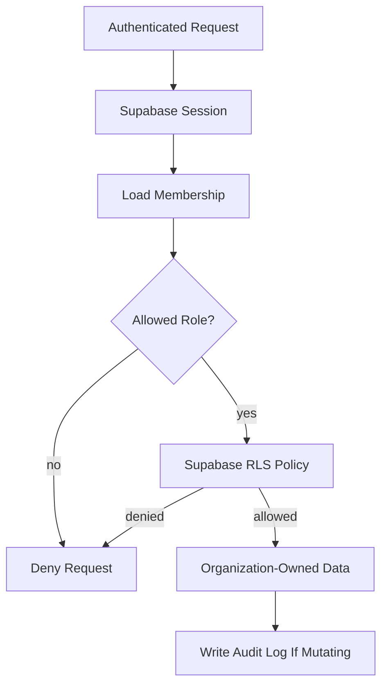

---

## 13. User Onboarding Flow

Shows the first-run experience for a new organization.

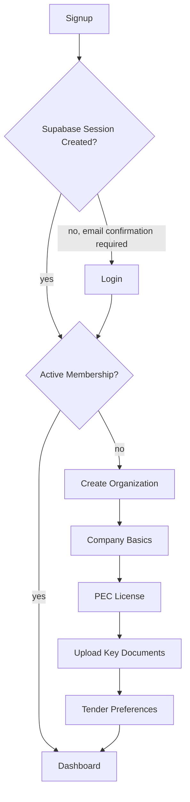

---

## 14. Authenticated Navigation Map

Shows primary app navigation and expected feature grouping.

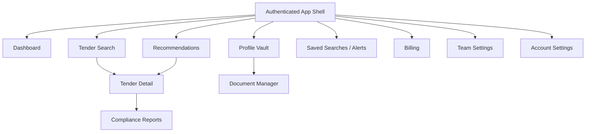

---

## 15. Public Site Navigation Map

Shows public pages and conversion paths.

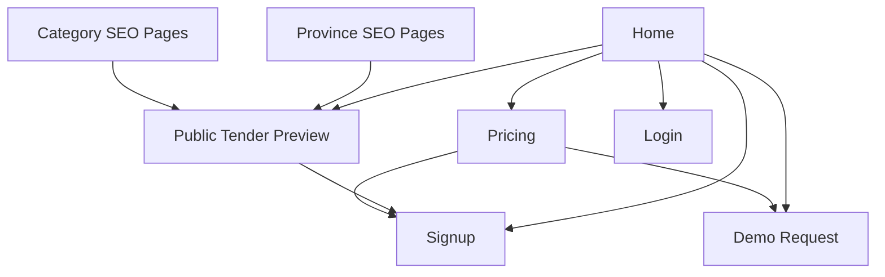

---

## 16. Contractor SaaS Monetization Funnel

Shows how the product converts contractor traffic into paid SaaS plans.

```mermaid
flowchart LR
    seo["SEO Tender / Contractor Category Pages"]
    preview["Limited Tender Preview"]
    signup["Signup"]
    onboarding["Contractor Onboarding"]
    profile["Profile Vault Completion"]
    value["Recommendations + Compliance Value Moment"]
    trial["Trial / Starter Plan"]
    paid["Paid Growth or Pro Plan"]
    retention["Alerts, Newspaper Coverage, Expiry Reminders"]
    expansion["More Users / Enterprise / Custom Sources"]

    seo --> preview
    preview --> signup
    signup --> onboarding
    onboarding --> profile
    profile --> value
    value --> trial
    trial --> paid
    paid --> retention
    retention --> expansion
```

---

## 17. Admin QA Workflow

Shows how ops users resolve low-confidence or ambiguous records.

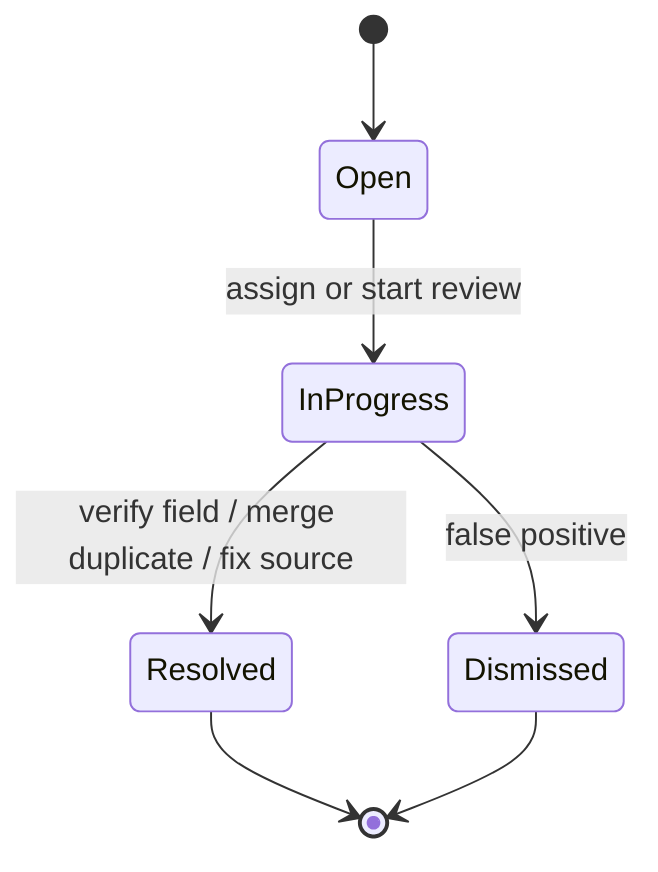

---

## 18. Tender Lifecycle State Machine

Shows tender status transitions.

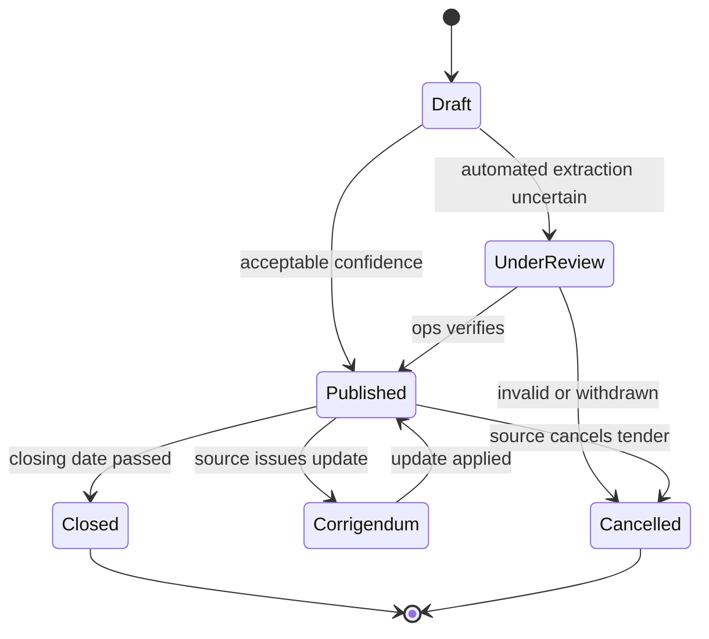

---

## 19. Source Health State Machine

Shows how tender sources move between active, failing, and disabled.

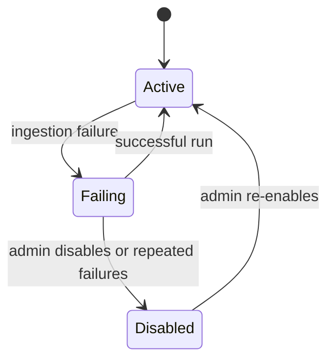

---

## 20. Payment and Subscription Flow

Shows subscription checkout and webhook handling.

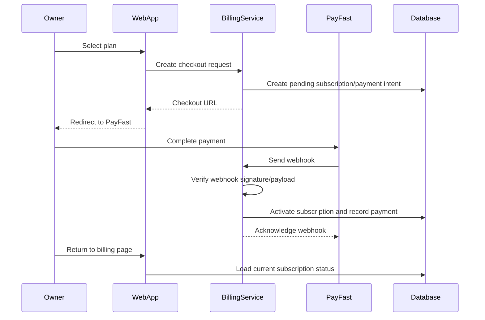

---

## 21. Alert Delivery Flow

Shows saved search and recommendation alert generation.

```mermaid
flowchart TD
    event["New Tender Published or Recommendation Rebuilt"]
    savedSearches["Load Saved Searches"]
    matchSearch{"Matches Saved Search?"}
    recThreshold{"Recommendation >= Threshold?"}
    notification["Create Notification"]
    channel{"Delivery Channel"}
    email["Send Email"]
    inApp["Show In-App"]
    whatsapp["WhatsApp Adapter"]
    log["Log Delivery Attempt"]
    retry{"Failed and Retryable?"}
    retryQueue["Schedule Retry"]

    event --> savedSearches
    savedSearches --> matchSearch
    event --> recThreshold
    matchSearch -- "yes" --> notification
    recThreshold -- "yes" --> notification
    matchSearch -- "no" --> end1["No Search Alert"]
    recThreshold -- "no" --> end2["No Recommendation Alert"]
    notification --> channel
    channel -- "email" --> email
    channel -- "in_app" --> inApp
    channel -- "whatsapp" --> whatsapp
    email --> log
    inApp --> log
    whatsapp --> log
    log --> retry
    retry -- "yes" --> retryQueue
    retry -- "no" --> done["Done"]
```

---

## 22. Data Quality Gate Flow

Shows how launch accuracy targets control whether fields are trusted.

```mermaid
flowchart TD
    sample["Manual QA Sample of 100+ Tenders"]
    measure["Measure Field Accuracy"]
    closing{"Closing Date >= 95%?"}
    source{"Department / Source URL >= 98%?"}
    bid{"Bid Security >= 90%?"}
    geo{"City / Province >= 90%?"}
    sector{"Sector >= 85%?"}
    pass["Field Can Be Trusted In Public UX"]
    qaMode["Keep Field In QA Review Mode"]
    improve["Improve Rules / Source Adapter"]

    sample --> measure
    measure --> closing
    closing --> source
    source --> bid
    bid --> geo
    geo --> sector
    sector -- "all pass" --> pass
    closing -- "no" --> qaMode
    source -- "no" --> qaMode
    bid -- "no" --> qaMode
    geo -- "no" --> qaMode
    sector -- "no" --> qaMode
    qaMode --> improve
    improve --> sample
```

---

## 23. Compliance Report Composition

Shows the sections required in every printable compliance report.

```mermaid
flowchart TD
    report["Compliance Report"]
    tenderDetails["Tender Details"]
    sourceEvidence["Source Evidence"]
    profileSnapshot["Company Profile Snapshot"]
    requirements["Detected Requirements"]
    checks["Checklist Results"]
    blockers["Blockers"]
    warnings["Warnings"]
    unknowns["Unknown / Needs Review"]
    nextSteps["Recommended Next Steps"]
    timestamp["Timestamp and Prepared By"]

    report --> tenderDetails
    report --> sourceEvidence
    report --> profileSnapshot
    report --> requirements
    report --> checks
    report --> blockers
    report --> warnings
    report --> unknowns
    report --> nextSteps
    report --> timestamp
```

---

## 24. Feature Gating Flow

Shows how subscription state gates premium features.

```mermaid
flowchart TD
    request["Feature Request"]
    org["Load Organization"]
    sub["Load Subscription"]
    status{"Subscription Active?"}
    plan{"Plan Allows Feature?"}
    allow["Allow Feature"]
    readonly["Allow Read-Only / Limited Preview"]
    deny["Deny With Upgrade Prompt"]
    grace{"Within Grace Period?"}

    request --> org
    org --> sub
    sub --> status
    status -- "yes" --> plan
    status -- "past_due" --> grace
    status -- "no" --> readonly
    grace -- "yes" --> plan
    grace -- "no" --> readonly
    plan -- "yes" --> allow
    plan -- "no" --> deny
```

---

## 25. End-to-End Happy Path

Shows the main product loop for a paying contractor.

```mermaid
journey
    title Contractor Finds and Evaluates a Tender
    section Onboarding
      Create account: 5: Owner
      Create organization: 5: Owner
      Complete Profile Vault: 4: Owner, Contractor Staff
      Upload documents: 4: Contractor Staff
    section Discovery
      Search tenders: 5: Contractor Staff
      Review recommendations: 5: Contractor Staff
      Open tender detail: 5: Contractor Staff
    section Readiness
      Run compliance check: 5: Contractor Staff
      Review blockers and warnings: 4: Contractor Staff
      Generate report: 5: Contractor Staff
    section Follow-up
      Save search alert: 4: Contractor Staff
      Receive matching tender alert: 5: Contractor Staff
```

---

## 26. Implementation Dependency Roadmap

Shows the safest build order for agents.

```mermaid
flowchart TD
    scaffold["Scaffold Monorepo"]
    db["Database, Enums, RLS, Storage"]
    auth["Auth, Organizations, Roles"]
    profile["Profile Vault"]
    manualTender["Manual Tender Entry"]
    source["First Source Adapter"]
    newspaper["Newspaper Source Adapter"]
    ingestion["Ingestion Worker"]
    parsing["Document Parsing and OCR"]
    extraction["Field Extraction"]
    qa["QA Dashboard"]
    search["Tender Search"]
    scoring["Recommendations"]
    compliance["Compliance Reports"]
    alerts["Saved Searches and Alerts"]
    billing["Billing and Plan Gates"]
    hardening["Monitoring, Backups, Launch QA"]

    scaffold --> db
    db --> auth
    auth --> profile
    auth --> manualTender
    manualTender --> source
    source --> newspaper
    source --> ingestion
    newspaper --> ingestion
    ingestion --> parsing
    parsing --> extraction
    extraction --> qa
    extraction --> search
    profile --> scoring
    search --> scoring
    scoring --> compliance
    compliance --> alerts
    alerts --> billing
    billing --> hardening
```

---

## 27. Tender Search Request Flow

Shows how public and authenticated tender searches share the same server-side search contract while preserving plan-gated visibility.

```mermaid
flowchart TD
    publicPage["/tenders Public Preview"]
    authPage["/search Authenticated App"]
    api["GET /api/tenders"]
    schema["tenderSearchSchema"]
    service["apps/web/lib/tender-search.ts"]
    plan{"Plan Access"}
    free["Free/Public Serializer"]
    paid["Paid/Ops Serializer"]
    postgres["Postgres tenders + search_document"]
    filters["Filter Indexes"]
    pec["extracted_fields PEC Filter"]
    recs["recommendations Score/Eligibility"]
    response["{ data, pagination, meta }"]

    publicPage --> service
    authPage --> service
    api --> schema
    schema --> service
    service --> postgres
    service --> filters
    service --> pec
    service --> recs
    service --> plan
    plan -- "free/public" --> free
    plan -- "paid/ops" --> paid
    free --> response
    paid --> response
```

---

## 28. Frontend Motion and UI Layer

Shows the frontend-only UI/UX enhancement layer. This layer does not change ingestion, scoring, database persistence, or backend authorization.

```mermaid
flowchart TD
    layout["app/layout.tsx"]
    pageTransition["PageTransition"]
    tokens["Tailwind Tokens + globals.css"]
    motionPrimitives["components/motion.tsx"]
    uiPrimitives["components/ui.tsx"]
    publicPages["Public Pages"]
    appShell["Authenticated App Shell"]
    dataPages["Dashboard, Search, Recommendations, Profile, Billing"]
    reducedMotion["prefers-reduced-motion"]

    layout --> pageTransition
    tokens --> uiPrimitives
    motionPrimitives --> pageTransition
    motionPrimitives --> dataPages
    uiPrimitives --> publicPages
    uiPrimitives --> appShell
    uiPrimitives --> dataPages
    reducedMotion --> tokens
    reducedMotion --> motionPrimitives
```
